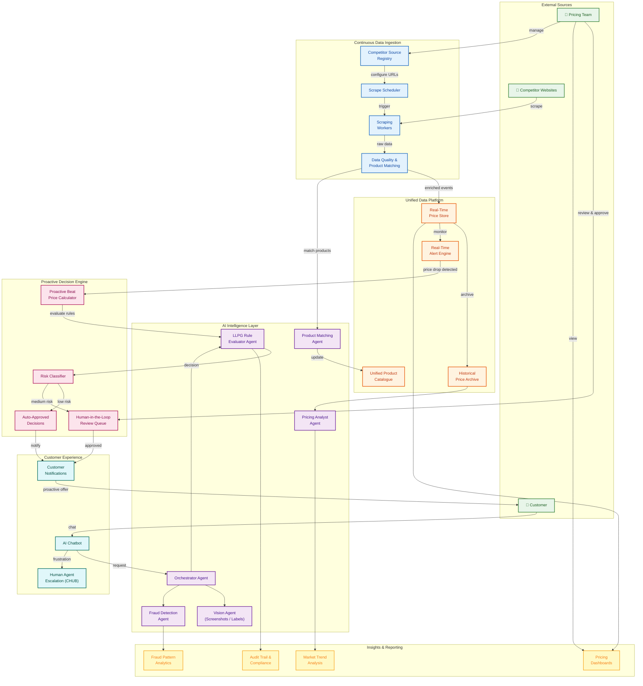

# Proactive Price Beat System — Solution Architecture 1
## AI Foundry Multi-Agent + Fabric Real-Time Intelligence + Azure Bot Service

---

## 1. Conceptual Diagram

> High-level view showing the key domains, data flows, and actors — technology-agnostic.

---

## 2. Azure Architecture Diagram

> Detailed view with specific Azure and Microsoft service names for each component.

```mermaid
graph TB
    subgraph External["External"]
        COMP["🏪 Competitor<br/>Websites"]
        CUST["👤 Customer<br/>(Web / Mobile / Teams)"]
        PRICING_TEAM["👥 Pricing Team"]
    end

    subgraph AdminLayer["Administration Layer"]
        ADMIN_UI["Azure Static Web Apps<br/>(React Admin Portal)"]
        COSMOS_REG["Azure Cosmos DB<br/>(Competitor Source Registry)"]
        APP_CONFIG["Azure App Configuration<br/>(Feature Flags &<br/>Rule Toggles)"]
    end

    subgraph EventBackbone["Event Backbone"]
        EH1["Azure Event Hubs<br/>scrape-commands"]
        EH2["Azure Event Hubs<br/>scrape-results"]
        EH3["Azure Event Hubs<br/>price-changes"]
        EH4["Azure Event Hubs<br/>beat-decisions"]
        EH5["Azure Event Hubs<br/>alerts"]
        EH6["Azure Event Hubs<br/>audit-events"]
        SB["Azure Service Bus<br/>(CHUB Escalation)"]
    end

    subgraph ScrapingLayer["Scraping Layer"]
        ACA_SCHED["Azure Functions<br/>(Timer Trigger Scheduler)"]
        ACA_SCRAPE["Azure Container Apps<br/>+ KEDA Scaler<br/>(Playwright Workers)"]
        ACA_DQ["Azure Functions<br/>(Data Quality &<br/>Normalization)"]
    end

    subgraph FabricPlatform["Microsoft Fabric — Unified Data Platform"]
        EVENTSTREAM["Fabric Eventstream<br/>(Ingestion & Routing)"]

        subgraph RealTime["Real-Time Intelligence"]
            EVENTHOUSE["Fabric Eventhouse<br/>(KQL Database)"]
            KQL_PRICES["CompetitorPriceSnapshots<br/>(versioned, time-series)"]
            KQL_RETAIL["RetailerProductPrices"]
            KQL_CATALOG["UnifiedProductCatalogue"]
            KQL_BEAT["BeatDecisions"]
            KQL_AUDIT["AuditTrail"]
            MAT_VIEW["Materialized Views<br/>(LatestPrice,<br/>PriceVelocity,<br/>ActivePromos)"]
        end

        DATA_ACT["Fabric Data Activator<br/>(Real-Time Reflexes)"]

        subgraph Historical["Historical & ML"]
            LAKEHOUSE["Fabric Lakehouse<br/>(Delta Tables)"]
            NOTEBOOKS["Fabric Notebooks<br/>(Spark + ML Training)"]
            PIPELINE["Fabric Data Pipeline<br/>(ERP / POS Ingestion)"]
        end

        SEMANTIC["Power BI<br/>Semantic Model"]
    end

    subgraph AILayer["Azure AI Foundry — Intelligence Layer"]
        subgraph SemanticKernel["Semantic Kernel Orchestration"]
            SK_ORCH["Orchestrator Agent"]

            subgraph Agents["Specialized Agents"]
                SK_MATCH["Product Matching Agent<br/>(Embeddings + Vector Search)"]
                SK_RULES["LLPG Rule Evaluator Agent"]
                SK_ANALYST["Pricing Analyst Agent"]
                SK_VISION["Vision Agent<br/>(GPT-4o Vision)"]
                SK_FRAUD["Fraud Detection Agent"]
            end

            subgraph RulePlugins["LLPG Rule Plugins (Semantic Kernel)"]
                P1["compute_beat_price"]
                P2["normalize_unit_price"]
                P3["validate_stock_for_stock"]
                P4["check_promo_limit"]
                P5["exclude_delivery_fee"]
                P6["check_lightning_sale"]
                P7["detect_member_discount"]
                P8["identify_clearance"]
                P9["assess_fraud_risk"]
                P10["check_rsa_compliance"]
                P11["check_radius_rule"]
            end
        end

        AOAI["Azure OpenAI Service<br/>(GPT-4o, GPT-4o Vision,<br/>text-embedding-3-large)"]
        AI_SEARCH["Azure AI Search<br/>(Vector Index +<br/>LLPG Knowledge Base)"]
        AML["Azure AI Foundry<br/>Managed Endpoint<br/>(Fraud ML Model)"]
    end

    subgraph ProactiveLayer["Proactive Decision Pipeline"]
        FUNC_PROACTIVE["Azure Functions<br/>(Event Trigger —<br/>Proactive Evaluator)"]
        RISK_CLASS["Risk Classifier<br/>(Semantic Kernel Plugin)"]
        PA_APPROVAL["Power Automate<br/>(Approval Flow)"]
        TEAMS_REVIEW["Microsoft Teams<br/>(Review Queue)"]
    end

    subgraph CustomerLayer["Customer Experience Layer"]
        BOT_SVC["Azure Bot Service<br/>(Web Chat, Mobile, Teams)"]
        SK_BOT["Semantic Kernel<br/>Chatbot Agent"]
        ACS["Azure Communication Services<br/>(Email / SMS Notifications)"]
        APIM["Azure API Management<br/>(Gateway + Auth)"]
    end

    subgraph Observability["Observability & Reporting"]
        APP_INS["Azure Monitor +<br/>Application Insights"]
        PBI["Power BI Dashboards<br/>+ Copilot"]
        PBI_RT["Power BI Real-Time<br/>Dashboard"]
    end

    subgraph Security["Security & Compliance"]
        KV["Azure Key Vault"]
        AAD["Microsoft Entra ID<br/>(Azure AD)"]
        REGION["Australia East Region"]
        PLINK["Azure Private Link"]
    end

    %% Admin & Configuration
    PRICING_TEAM -->|"manage sources"| ADMIN_UI
    ADMIN_UI --> COSMOS_REG
    PRICING_TEAM -->|"toggle rules"| APP_CONFIG

    %% Scraping Pipeline
    COSMOS_REG -->|"read schedules"| ACA_SCHED
    ACA_SCHED -->|"emit"| EH1
    EH1 -->|"KEDA trigger"| ACA_SCRAPE
    COMP -->|"scrape"| ACA_SCRAPE
    ACA_SCRAPE -->|"emit"| EH2
    EH2 -->|"trigger"| ACA_DQ
    ACA_DQ -->|"call embeddings"| AOAI
    ACA_DQ -->|"emit enriched"| EH3

    %% Fabric Ingestion
    EH3 --> EVENTSTREAM
    EH4 --> EVENTSTREAM
    EH6 --> EVENTSTREAM
    EVENTSTREAM --> EVENTHOUSE
    EVENTSTREAM --> LAKEHOUSE
    EVENTHOUSE --> KQL_PRICES
    EVENTHOUSE --> KQL_BEAT
    EVENTHOUSE --> KQL_AUDIT
    EVENTHOUSE --> MAT_VIEW
    PIPELINE -->|"ERP/POS sync"| KQL_RETAIL
    EVENTHOUSE --> DATA_ACT

    %% AI Processing
    ACA_DQ -->|"unmatched products"| SK_MATCH
    SK_MATCH --> AI_SEARCH
    SK_MATCH -->|"update"| KQL_CATALOG
    SK_RULES --> P1
    SK_RULES --> P2
    SK_RULES --> P3
    SK_RULES --> P4
    SK_RULES --> P5
    SK_RULES --> P6
    SK_RULES --> P7
    SK_RULES --> P8
    SK_RULES --> P9
    SK_RULES --> P10
    SK_RULES --> P11
    SK_RULES -->|"read config"| COSMOS_REG
    SK_RULES -->|"read flags"| APP_CONFIG
    SK_FRAUD --> AML
    SK_ORCH --> SK_MATCH
    SK_ORCH --> SK_RULES
    SK_ORCH --> SK_VISION
    SK_ORCH --> SK_FRAUD
    SK_ORCH --> SK_ANALYST
    SK_ANALYST -->|"KQL queries"| EVENTHOUSE
    AOAI --- SK_ORCH

    %% Proactive Pipeline
    DATA_ACT -->|"price drop alert"| EH5
    EH5 -->|"trigger"| FUNC_PROACTIVE
    FUNC_PROACTIVE -->|"evaluate"| SK_RULES
    FUNC_PROACTIVE -->|"classify"| RISK_CLASS
    RISK_CLASS -->|"auto-approve"| EH4
    RISK_CLASS -->|"needs review"| PA_APPROVAL
    PA_APPROVAL --> TEAMS_REVIEW
    PRICING_TEAM -->|"approve/reject"| TEAMS_REVIEW
    TEAMS_REVIEW -->|"approved"| EH4
    EH4 -->|"notify customer"| ACS
    ACS -->|"email/SMS"| CUST

    %% Customer Chatbot
    CUST -->|"chat"| BOT_SVC
    BOT_SVC --> APIM
    APIM --> SK_BOT
    SK_BOT --> SK_ORCH
    SK_BOT -->|"RAG"| AI_SEARCH
    SK_BOT -->|"pre-computed beats"| EVENTHOUSE
    SK_BOT -->|"frustration detected"| SB
    SB -->|"escalate to CHUB"| PRICING_TEAM

    %% Insights & Reporting
    NOTEBOOKS -->|"ML models"| AML
    LAKEHOUSE --> NOTEBOOKS
    SEMANTIC --> PBI
    EVENTHOUSE --> PBI_RT
    EVENTHOUSE --> SEMANTIC
    APP_INS -->|"system health"| PBI

    %% Security (subtle connections)
    KV -.->|"secrets"| ACA_SCRAPE
    KV -.->|"secrets"| AOAI
    AAD -.->|"auth"| APIM
    AAD -.->|"managed identity"| ACA_SCRAPE

    %% Styling
    classDef external fill:#E8F5E9,stroke:#2E7D32,stroke-width:2px,color:#1B5E20
    classDef admin fill:#EFEBE9,stroke:#4E342E,stroke-width:1px,color:#3E2723
    classDef events fill:#E8EAF6,stroke:#283593,stroke-width:1px,color:#1A237E
    classDef scraping fill:#E3F2FD,stroke:#1565C0,stroke-width:2px,color:#0D47A1
    classDef fabric fill:#FFF3E0,stroke:#E65100,stroke-width:2px,color:#BF360C
    classDef realtime fill:#FFE0B2,stroke:#EF6C00,stroke-width:1px,color:#E65100
    classDef ai fill:#F3E5F5,stroke:#6A1B9A,stroke-width:2px,color:#4A148C
    classDef plugins fill:#EDE7F6,stroke:#4527A0,stroke-width:1px,color:#311B92
    classDef proactive fill:#FCE4EC,stroke:#AD1457,stroke-width:2px,color:#880E4F
    classDef customer fill:#E0F7FA,stroke:#00695C,stroke-width:2px,color:#004D40
    classDef observe fill:#FFF9C4,stroke:#F9A825,stroke-width:1px,color:#F57F17
    classDef security fill:#ECEFF1,stroke:#546E7A,stroke-width:1px,color:#37474F

    class COMP,CUST,PRICING_TEAM external
    class ADMIN_UI,COSMOS_REG,APP_CONFIG admin
    class EH1,EH2,EH3,EH4,EH5,EH6,SB events
    class ACA_SCHED,ACA_SCRAPE,ACA_DQ scraping
    class EVENTSTREAM,EVENTHOUSE,KQL_PRICES,KQL_RETAIL,KQL_CATALOG,KQL_BEAT,KQL_AUDIT,MAT_VIEW,DATA_ACT,LAKEHOUSE,NOTEBOOKS,PIPELINE,SEMANTIC fabric
    class SK_ORCH,SK_MATCH,SK_RULES,SK_ANALYST,SK_VISION,SK_FRAUD,AOAI,AI_SEARCH,AML ai
    class P1,P2,P3,P4,P5,P6,P7,P8,P9,P10,P11 plugins
    class FUNC_PROACTIVE,RISK_CLASS,PA_APPROVAL,TEAMS_REVIEW proactive
    class BOT_SVC,SK_BOT,ACS,APIM customer
    class APP_INS,PBI,PBI_RT observe
    class KV,AAD,REGION,PLINK security
```

---

## Legend

| Color | Domain |
|-------|--------|
| 🟢 Green | External actors (Customer, Competitors, Pricing Team) |
| 🔵 Blue | Scraping & Ingestion Layer |
| 🟠 Orange | Microsoft Fabric (Unified Data Platform) |
| 🟣 Purple | Azure AI Foundry + Semantic Kernel (Intelligence) |
| 🔴 Pink | Proactive Decision Pipeline |
| 🩵 Teal | Customer Experience (Bot, Notifications) |
| 🟡 Yellow | Observability & Reporting |
| ⚪ Grey | Security & Compliance |

---

## Key Azure Services Used

| Category | Services |
|----------|----------|
| **AI & ML** | Azure AI Foundry, Azure OpenAI Service (GPT-4o, Vision, Embeddings), Azure AI Search, Semantic Kernel |
| **Data Platform** | Microsoft Fabric (Eventhouse, Lakehouse, Eventstream, Data Activator, Notebooks, Data Pipeline) |
| **Compute** | Azure Container Apps + KEDA, Azure Functions |
| **Messaging** | Azure Event Hubs, Azure Service Bus |
| **Bot & Comms** | Azure Bot Service, Azure Communication Services |
| **Config & Admin** | Azure Cosmos DB, Azure App Configuration, Azure Static Web Apps |
| **Automation** | Power Automate, Microsoft Teams |
| **Reporting** | Power BI + Copilot |
| **Security** | Azure Key Vault, Microsoft Entra ID, Azure Private Link |
| **Region** | Australia East |
