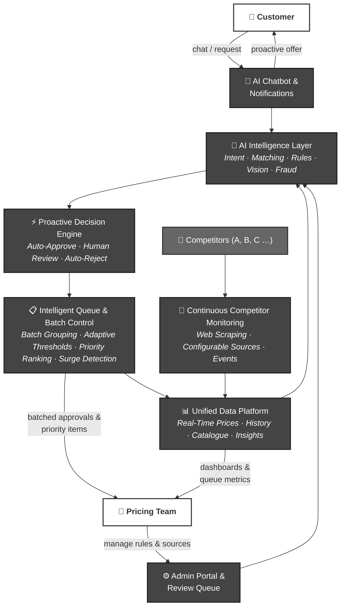
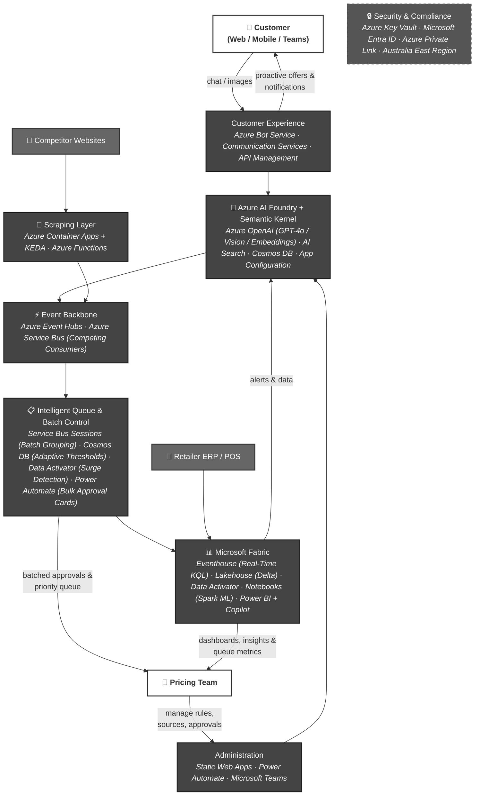

# Proactive Price Beat System — Executive View
## Solution Architecture 1: AI-First with Unified Data Platform

---

## 1. Conceptual Diagram

> How the system works — no technology names, executive-friendly.  
> Customer on the left, Pricing Team on the right, system in the centre.  
> Top-down flow to minimize line crossings.



### How It Works (Executive Summary)

1. **Competitors are continuously monitored** — The system scrapes competitor prices on a configurable schedule
2. **All pricing data is unified** — Competitor prices and our prices live in one platform with full history
3. **AI evaluates every price change** — Rules engine automatically determines if we should beat the price
4. **Risk-based decisions** — Low-risk beats are auto-approved; complex cases go to the pricing team for review
5. **Intelligent queue handles volume at scale** — Batches related decisions together, prioritises by revenue impact, and adapts thresholds during surge events so the team only reviews what truly needs human judgement
6. **Customers are proactively notified** — Before they even ask, we offer them the better price
7. **Customers can also ask** — The AI chatbot handles reactive requests in real-time too

---

## 2. Azure Solution Architecture Diagram

> Technology and services mapped to each layer.  
> Customer on the left, Pricing Team on the right.  
> Top-down flow to minimize line crossings.



### Azure Services Summary

| Layer | Services |
|-------|----------|
| **Customer Experience** | Azure Bot Service, Azure Communication Services, Azure API Management |
| **Administration** | Azure Static Web Apps, Power Automate, Microsoft Teams |
| **AI Intelligence** | Azure AI Foundry, Semantic Kernel, Azure OpenAI (GPT-4o / Vision / Embeddings), Azure AI Search |
| **Configuration** | Azure Cosmos DB, Azure App Configuration |
| **Event Backbone** | Azure Event Hubs, Azure Service Bus (Competing Consumers) |
| **Queue & Batch Control** | Service Bus Sessions, Cosmos DB (thresholds), Data Activator (surge), Power Automate (bulk cards) |
| **Unified Data** | Microsoft Fabric (Eventhouse, Lakehouse, Data Activator, Notebooks, Power BI + Copilot) |
| **Scraping** | Azure Container Apps + KEDA, Azure Functions |
| **Security** | Azure Key Vault, Microsoft Entra ID, Azure Private Link, Australia East Region |

---

## 3. Scaling Strategy — Handling High-Volume Price Beat Events

> When a competitor runs a site-wide sale or multiple competitors change prices simultaneously, thousands of beat decisions can arrive within minutes. This section explains how the architecture handles that at scale without overwhelming the pricing team.

### The Scale Challenge

| Scenario | Estimated Volume |
|----------|-----------------|
| Single competitor site-wide sale (e.g., 20% off all spirits) | ~500–2,000 decisions simultaneously |
| Multiple competitors change prices on the same day | ~3,000–10,000 decisions |
| Holiday season (Boxing Day, EOFY) | Sustained high volume over days |
| New competitor added to monitoring | Initial backfill of entire catalogue |

A pricing team of 5–10 people **cannot review thousands of individual decisions**. The solution uses a 5-layer scaling strategy to ensure the team only reviews what truly requires human judgement.

### 5-Layer Scaling Strategy

| # | Strategy | What It Does | Azure Implementation |
|---|----------|-------------|---------------------|
| 1 | **Batch Grouping** | Groups related decisions by trigger (same competitor + same event, e.g., "BWS 20% off spirits"). Team reviews the batch policy once → all items inherit the decision. | Azure Service Bus **sessions** group correlated messages; Cosmos DB stores batch metadata |
| 2 | **Adaptive Auto-Approval** | Dynamically adjusts confidence thresholds based on queue depth. **Normal mode:** >95% confidence = auto-approve. **Surge mode** (queue >500): lowers to >85% = auto-approve + post-audit flag. | Cosmos DB stores threshold config; Azure Functions recalculates thresholds per queue depth signals |
| 3 | **Priority Queue with SLA** | Scores each review item by: revenue impact × time sensitivity × margin delta. High-value items surface first; low-value items auto-approve after configurable timeout. | Service Bus **priority queues**; Cosmos DB scoring model; Azure Functions timeout worker |
| 4 | **Category-Based Routing** | Routes decisions to specialists: wine/vintage → wine expert, spirits/beer → general team, fraud-flagged → fraud analyst. Prevents bottlenecks from generalist review. | Service Bus **topic subscriptions** with category filters; Power Automate routes to Teams channels per category |
| 5 | **Surge Detection & Alerting** | Monitors queue depth, arrival rate, and average processing time in real-time. Triggers: team alerts, automatic mode switches (normal → surge), overtime staffing signals. | Fabric **Data Activator** reflexes; Power BI real-time dashboard for queue metrics; Power Automate escalation flows |

### How Batch Approval Works (Example)

1. Competitor BWS drops prices on 800 spirit products by 15%
2. Scraping layer detects 800 price changes → 800 events flow through Event Hubs
3. AI evaluates all 800 → produces 800 beat decisions
4. **Batch Grouping** recognises all 800 share the same trigger ("BWS spirits sale") and groups them into **1 batch**
5. Pricing team receives **1 approval card** in Teams: *"BWS spirits sale — 800 products, avg beat $2.40, total margin impact $1,920. Approve all?"*
6. Team reviews the batch policy, clicks **Approve All** → 800 customers notified instantly
7. Edge cases within the batch (e.g., vintage wine, clearance) are separated as individual items for dedicated review

### Adaptive Mode Switching

```
Queue Depth < 100  →  NORMAL MODE   (strict thresholds, all medium-risk → human review)
Queue Depth 100-500 →  ELEVATED MODE (relax thresholds slightly, batch similar items)
Queue Depth > 500  →  SURGE MODE    (aggressive auto-approve, post-audit, bulk cards, team alerts)
```

All mode transitions are **logged and auditable**. Post-audit reports are generated automatically for any decisions auto-approved during surge mode.

### Power BI Queue Metrics Dashboard

The pricing team leader has a **real-time Power BI dashboard** (with Copilot natural language queries) showing:

- **Queue depth** — current items awaiting review
- **Arrival rate** — decisions per minute (trend line)
- **Processing rate** — approvals per minute per team member
- **SLA compliance** — % of items reviewed within target time
- **Batch summary** — active batches, sizes, estimated impact
- **Mode indicator** — current operating mode (Normal / Elevated / Surge)
- **Post-audit backlog** — items auto-approved in surge mode pending retrospective review
